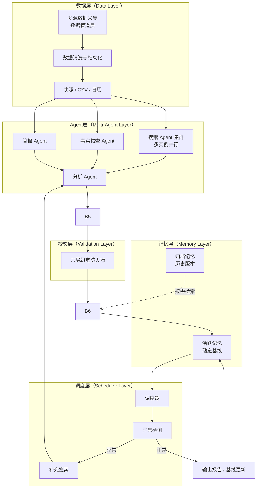

# LLM Macro Analysis Agent

一个基于多Agent协作的RAG系统，用于自动化宏观数据分析。

## 核心特性

- **多Agent协作架构**：搜索、校验、简报、分析四层独立Agent
- **RAG全链路**：从多源数据采集到结构化报告生成
- **六层幻觉防火墙**：工程化抑制LLM幻觉，评分波动约束在±0.2
- **分层记忆机制**：活跃记忆与归档记忆分离，兼顾效率与知识完整
- **动态知识库**：支持规则迭代、版本归档、质量评估闭环
- **异常检测**：自动检测数据异常并触发补充检索

## 架构

## 技术栈

Python · Pandas · Prompt Engineering · Multi-Agent · RAG

## 说明

本仓库仅公开系统架构与通用工具代码。
核心评分规则、数据阈值、权重配比属于项目机密，不在开源范围。